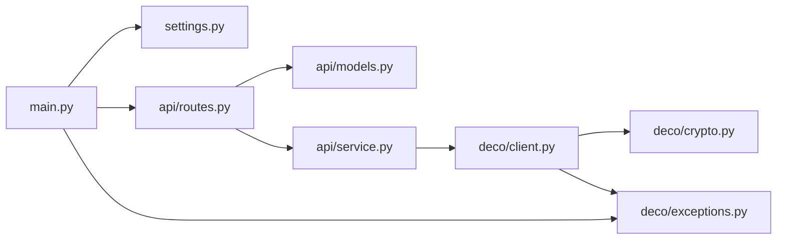

# Deco BE85 API

[](https://github.com/msageha/tplink-deco-be85-api/actions/workflows/ci.yaml)

TP-Link Deco BE85 のローカル Web API (Deco アプリが内部で叩いている API) を
FastAPI + Pydantic でラップした REST サーバーです。ステータス取得や Wi-Fi の
ON/OFF などをローカルネットワークから操作できます。

## セットアップ

このリポジトリは [mise](https://mise.jdx.dev/) の利用を前提としています。

```bash
mise trust    # 初回のみ: このディレクトリの mise.toml を信頼する
mise install  # ツールをインストールし、uv sync と git hooks のセットアップを行う
```

`mise install` を実行すると `[hooks] postinstall` により `uv sync --locked` (依存関係を `.venv` に入れる) と
`prek install` (`.git/hooks/pre-commit` と `.git/hooks/commit-msg` の登録) が自動実行されます。
`.pre-commit-config.yaml` の hook 構成が変わったあとの既存 clone では `mise exec -- prek install` を再実行してください。

以前 `uv run pre-commit install` で hook を登録していた clone では、`mise exec -- prek install --force` で
旧 hook を置き換えてください。置き換えないと prek が旧 hook (`.git/hooks/pre-commit.legacy`) も実行し、
`uv sync` で削除された pre-commit package を呼んで commit が失敗します。

認証情報はリポジトリ直下の `.env` に記載します。`.env.example` をコピーして編集してください。

```bash
cp .env.example .env
```

```dotenv
PASSWORD=<Deco 管理パスワード (TP-Link ID のパスワード)>
# 任意 (既定値)
DECO_HOST=http://172.16.1.1
ACCOUNT=admin        # 署名 hash に使うローカルアカウント名 (通常 admin のまま)
VERIFY_SSL=false
TIMEOUT=30
```

## 起動

```bash
mise run dev   # = uv run uvicorn main:app --reload --app-dir src --host 127.0.0.1 --port 8000
```

- Swagger UI: http://127.0.0.1:8000/docs
- ルーターへのログインは遅延 (最初の API 呼び出し時)。401/403 やログイン画面 (非 JSON) が
  返ったら自動で再ログインして 1 回だけ再送します。
- `DecoClient` はセッション状態を持つため、リクエストはサーバー側の lock で直列化されます。

### Docker

```bash
mise run build-image   # docker build -t deco-be85-api:latest .
mise run run-image     # docker run --rm -p 8000:8000 --env-file .env deco-be85-api:latest
```

多段ビルド (`uv` ビルダ → `python:slim` ランナー、非 root 実行)。認証情報は
`--env-file .env` などで実行時に注入します (イメージには含めません)。

## エンドポイント

| Method | Path                           | 説明                                            |
| ------ | ------------------------------ | ----------------------------------------------- |
| GET    | `/api/health`                  | サーバー状態とログイン状況                      |
| POST   | `/api/login`                   | 明示ログイン                                    |
| POST   | `/api/logout`                  | ログアウト                                      |
| GET    | `/api/dashboard`               | 概況 (回線 / CPU / メモリ / Deco 台数 / 接続数) |
| GET    | `/api/devices`                 | Deco ユニット (メッシュノード) 一覧             |
| GET    | `/api/clients`                 | 接続クライアント一覧 (`?online_only=true`)      |
| GET    | `/api/clients/blocked`         | ブロック中クライアント一覧                      |
| GET    | `/api/network/wan`             | WAN IPv4 ステータス                             |
| GET    | `/api/network/internet`        | インターネット接続情報 (IPv4 / IPv6)            |
| GET    | `/api/network/lan`             | LAN / DHCP DNS / WAN IP                         |
| GET    | `/api/network/ipv6`            | IPv6 有効状態                                   |
| GET    | `/api/network/performance`     | CPU / メモリ使用率                              |
| GET    | `/api/network/mac-clone`       | MAC クローン設定                                |
| GET    | `/api/network/wan-mode`        | WAN ポートの動作モード                          |
| GET    | `/api/network/dhcp-dial`       | WAN の DHCP 接続設定 (unicast)                  |
| GET    | `/api/network/igmp`            | IGMP (マルチキャスト) 設定                      |
| GET    | `/api/network/fast-xmit`       | fast xmit の有効状態                            |
| GET    | `/api/network/vlan`            | VLAN (IPTV) 設定                                |
| GET    | `/api/network/ddns`            | DDNS の有効状態とドメイン                       |
| GET    | `/api/wireless`                | Wi-Fi 設定の取得                                |
| POST   | `/api/wireless`                | バンド別 Wi-Fi の ON/OFF                        |
| POST   | `/api/wireless/config`         | Wi-Fi 設定変更 (SSID / パスワード / enable 等)  |
| GET    | `/api/wireless/power`          | 電波 (DFS サポート等)                           |
| GET    | `/api/wireless/beamforming`    | beamforming の有効状態                          |
| GET    | `/api/wireless/operation-mode` | 無線の動作モード (AP / router)                  |
| GET    | `/api/wireless/bridge`         | ブリッジ / PLC 状態                             |
| GET    | `/api/wireless/roaming`        | 802.11r 高速ローミングの有効状態                |
| GET    | `/api/wireless/bandwidth`      | 160MHz 幅 (HT160) の有効状態                    |
| GET    | `/api/device/mode`             | 動作モード (region / workmode / sysmode)        |
| GET    | `/api/device/time`             | 時刻・タイムゾーン設定                          |
| GET    | `/api/device/speedtest`        | 直近のスピードテスト結果                        |
| GET    | `/api/cloud/device-info`       | クラウド連携情報 (model / role 等)              |
| GET    | `/api/cloud/login-status`      | TP-Link ID のログイン状態                       |
| GET    | `/api/system/component-info`   | ERP / 省電力等のコンポーネント情報              |
| GET    | `/api/system/switch-list`      | UI 機能スイッチ                                 |
| GET    | `/api/system/log-types`        | ログ種別 (`/api/system/log` の `level`)         |
| GET    | `/api/system/log`              | システムログ (`?level=&index=&limit=`)          |
| GET    | `/api/system/firmware`         | ファームウェア更新の有無 (cloud に問い合わせ)   |
| POST   | `/api/reboot`                  | Deco の再起動 (`confirm=true` 必須)             |
| POST   | `/api/raw`                     | 任意エンドポイントへの汎用パススルー            |

モデル (`DecoNode` 等) を定義している endpoint 以外は、ルーターの応答をそのまま返します
(フィールドはファームウェアで異なりうる)。モデル化した endpoint も主要フィールドだけを定義し、
未知のフィールドは保持して返します (`extra="allow"`)。

### エラー

| Status    | 意味                                                                  |
| --------- | --------------------------------------------------------------------- |
| 400 / 422 | リクエスト検証エラー (`confirm` 無し、未知の `settings` フィールド等) |
| 401       | ルーターへのログイン失敗 (`DecoAuthError`)                            |
| 502       | ルーターがエラーを返した (`detail` と `error_code`)                   |
| 504       | ルーターに到達できない (`DecoConnectionError`)                        |

### Wi-Fi トグル例

```bash
curl -X POST http://127.0.0.1:8000/api/wireless \
  -H 'Content-Type: application/json' \
  -d '{"band":"band5_1","network":"host","enable":false}'
```

`band` は `band2_4` / `band5_1` / `band6`、`network` は `host` / `guest` (enum で検証)。

### Wi-Fi 詳細設定の変更 `/api/wireless/config`

`admin/wireless?form=wlan` への `operation:write`。`band` × `network` (host / guest) ごとに
`enable` / `ssid` / `password` / `enable_hide_ssid` / `channel` / `channel_width` / `mode`
を指定できます (指定したフィールドのみ送信)。`ssid` / `password` は**平文で渡すと内部で
base64 エンコード**します (ルーターは base64 で保持するため)。

```bash
# ゲスト Wi-Fi の SSID とパスワードを変更
curl -X POST http://127.0.0.1:8000/api/wireless/config \
  -H 'Content-Type: application/json' \
  -d '{"band":"band5_1","network":"guest","settings":{"enable":true,"ssid":"My Guest","password":"secretpass"}}'
```

> Wi-Fi 設定の変更は接続中クライアントに一時的な影響があります。`settings` は未知フィールドを
> 拒否 (`extra="forbid"`) し、最低 1 項目の指定が必須です。設定値は `GET /api/wireless` の構造
> (`band.host` / `band.guest`) に対応します。

### システムログ `/api/system/log`

`admin/log_export?form=feedback_log` を `operation:build` → `operation:read` の順に呼びます
(Web UI と同じ手順。build でルーター側に level で絞ったスナップショットを作らせる)。

```bash
curl 'http://127.0.0.1:8000/api/system/log?level=3&index=0&limit=100'
```

- `level`: `/api/system/log-types` の `value` (1 ALERT 〜 7 DEBUG、8 ALL。既定 8)。その重要度までを含む
- `index`: 0 始まりのページ番号 (既定 0)
- `limit`: 1 ページの件数 (既定 100)
- 応答: `{"totalNum": <limit での総ページ数>, "currentIndex": <index>, "logList": [{"content": "..."}]}`

### ファームウェア更新チェック `/api/system/firmware`

`admin/cloud?form=firmware_status` の `operation:check` で TP-Link cloud に問い合わせ、ノードごとの
`software_ver` / `new_version` / `need_to_upgrade` などを返します (数秒かかる)。更新の適用
(`operation:download` / `upgrade`) は提供しません。

### 汎用パススルー `/api/raw`

任意の Deco エンドポイントを直接叩けます。レスポンスは復号済みのエンベロープ全体
(`result` / `error_code` または `success` / `data`) をそのまま返します。

```bash
curl -X POST http://127.0.0.1:8000/api/raw \
  -H 'Content-Type: application/json' \
  -d '{"path":"admin/client?form=client_list","operation":"read","params":{"device_mac":"default"}}'
```

- `path`: `admin/<module>?form=<form>` 形式の相対パス (英数字と `_`、`/`、1 つの `?form=` のみ)
- `operation`: `read` / `write` / `load` / `list` / `get` / `set` / `add` / `edit` / `remove` / `operate` / `check` / `build` (enum)
- `params`: 任意の追加パラメータ (省略可)

> `operation: write` と適切な `params` を渡すと設定を変更できる強力な口です。

### 再起動例 (破壊的操作)

```bash
curl -X POST http://127.0.0.1:8000/api/reboot \
  -H 'Content-Type: application/json' -d '{"confirm":true}'
```

## 開発

Python のツールチェーンは uv (依存関係と Python 本体)、ruff (lint + formatter)、ty (型チェック)、pytest です。
それ以外のツールは `mise.toml` の `[tools]` で exact version に pin し、`mise.lock` でプラットフォームごとの
URL / checksum を固定しています。CI (`ci.yaml`) もローカルも同じ `mise.lock` からツールを解決するため、
同じ検証をローカルで再現できます。タスクの一覧は末尾の「[タスク](#タスク)」を参照してください。

```bash
mise run format                          # ruff format .
mise run lint                            # ruff format --check + ruff check + ty check
mise run test                            # coverage run -m pytest + report (オフライン。実機には触れません)
mise exec -- prek run --all-files        # pre-commit hooks を全ファイルに対して実行する (CI の prek job と同じ)
mise exec -- gitleaks git --redact -v .  # コミット履歴全体のシークレットスキャン (CI の gitleaks job と同じ)
```

- [prek](https://github.com/j178/prek): pre-commit hook の実行基盤。hooks は `.pre-commit-config.yaml` で定義します。
  ruff / ty の hook は `uv run --locked` で動かし、バージョンは `uv.lock` に一元化しています。
- [dprint](https://dprint.dev/): json / markdown / toml / yaml のフォーマッタ (`dprint-fmt` hook)。
  plugin の WASM URL は `dprint.json` に `url@sha256` の checksum 付きで pin します。`uv.lock` / `mise.lock` は対象外。
- [actionlint](https://github.com/rhysd/actionlint): workflow の静的検査 (`actionlint-system` hook)。
  `run:` スクリプトの検査に [shellcheck](https://github.com/koalaman/shellcheck) を使います。actionlint は PATH に
  shellcheck が無いとその検査を黙って省くため、ローカルと CI で結果が変わらないように mise で pin しています。
- [hadolint](https://github.com/hadolint/hadolint): `Dockerfile` の静的検査 (`hadolint` hook)。
- [gitleaks](https://github.com/gitleaks/gitleaks): シークレットスキャン。pre-commit hook (`gitleaks` hook) が
  staged 差分を、CI の `gitleaks` job がコミット履歴全体を対象にします。
- [commitlint](https://commitlint.js.org/): commit message を
  [Conventional Commits](https://www.conventionalcommits.org/) で検査する commit-msg hook (`commitlint` hook)。
  ルールは `commitlint.config.mjs`。prek が node を自前で用意するため、リポジトリに node は不要です。
- [fnox](https://fnox.jdx.dev/): secret manager。`fnox.toml` の `[daemon]` は解決済みの secret をメモリに
  キャッシュする daemon を有効化し、`idle_timeout` (12h) 無操作で終了させる設定です。

`.gitignore` はホワイトリスト方式 (`*` で全て無視し、`!` で許可したものだけを追跡する) です。
新しく追跡したいファイルを追加する場合は、対応する `!` の行を追記してください。

### mise.toml / mise.lock を手で変更するとき

`mise.toml` の `[tools]` を手で変更したら `mise lock` を実行して `mise.lock` を追従させ、両方を同じ commit に
含めます。CI の mise-action は `mise.lock` があると `mise install --locked` でインストールするため、`mise.lock` が
古いままだと CI の各 job で失敗します。

### 依存関係の更新 (Renovate)

`renovate.json` で以下を Renovate に任せています。

- `pyproject.toml` の依存バージョンと `uv.lock` の更新、`uv.lock` の週次再解決 (`lockFileMaintenance`)。
- `mise.toml` のバージョン bump と、それに伴う `mise.lock` の更新 (同じ PR で行われる)。
- `.pre-commit-config.yaml` の hook `rev` と、`language: node` の hook の `additional_dependencies`。
- workflow の `uses:` の commit SHA (バージョンはコメントで併記し、Renovate が両方を更新する)。
- `dprint.json` の plugin URL と checksum (`customManagers`)。

`Dockerfile` の Python は Renovate の対象外です (tag の一部だけを `ARG PYTHON_VERSION` で変数にしているため、dockerfile manager が
置換位置を特定できない)。更新は `ARG PYTHON_VERSION` を手で書き換えます (ビルダとランナーの両イメージが同じ値を参照する)。

major 以外の更新は 1 つの PR に集約します。このうち minor / patch は `minimumReleaseAge` (7 日) 経過後、
CI green を条件に Renovate 自身が自動マージします (`platformAutomerge: false`)。major は個別 PR で人手レビューします。

### CI

`.github/workflows/ci.yaml` は pull request 時に以下の job を並列実行します。job 名がそのまま
required status check の名前になります。

- `prek`: `mise.lock` 通りのツールで `.pre-commit-config.yaml` の全 hook を `prek run --all-files` で実行します。
  ruff / ty の hook は `uv run --locked` で動くため、`uv.lock` と `pyproject.toml` の不整合もここで失敗します。
- `gitleaks`: コミット履歴全体を対象にシークレットスキャンを行います。
- `verify`: `uv run --locked pytest` でテストを実行します。

main への push では実行しません (main は PR 必須で、変更は PR の CI で検証してから merge されます)。
workflow の外部依存 (`uses:`) は commit SHA で固定し、バージョンをコメントで併記します。

### GitHub リポジトリ設定

ファイルとして管理できないリポジトリ設定です。public リポジトリなので ruleset と secret scanning が使えます。
required checks は `ci.yaml` の job 名 (`prek` / `gitleaks` / `verify`) に合わせます。

```bash
REPO=msageha/tplink-deco-be85-api

# merge 方式: squash のみ / squash タイトルは COMMIT_OR_PR_TITLE /
# merge 後にブランチ自動削除 / wiki off
gh api -X PATCH "repos/$REPO" --input - <<'JSON'
{
  "allow_merge_commit": false,
  "allow_rebase_merge": false,
  "allow_squash_merge": true,
  "squash_merge_commit_title": "COMMIT_OR_PR_TITLE",
  "squash_merge_commit_message": "COMMIT_MESSAGES",
  "delete_branch_on_merge": true,
  "has_wiki": false
}
JSON

# main を PR 必須・CI green 必須・squash merge 限定・force push / 削除禁止・linear history にする
gh api -X POST "repos/$REPO/rulesets" --input - <<'JSON'
{
  "name": "Protect main",
  "target": "branch",
  "enforcement": "active",
  "bypass_actors": [],
  "conditions": {"ref_name": {"include": ["refs/heads/main"], "exclude": []}},
  "rules": [
    {"type": "deletion"},
    {"type": "non_fast_forward"},
    {"type": "required_linear_history"},
    {"type": "pull_request", "parameters": {
      "required_approving_review_count": 0,
      "dismiss_stale_reviews_on_push": false,
      "require_code_owner_review": false,
      "require_last_push_approval": false,
      "required_review_thread_resolution": false,
      "allowed_merge_methods": ["squash"]
    }},
    {"type": "required_status_checks", "parameters": {
      "do_not_enforce_on_create": false,
      "strict_required_status_checks_policy": false,
      "required_status_checks": [
        {"context": "prek", "integration_id": 15368},
        {"context": "gitleaks", "integration_id": 15368},
        {"context": "verify", "integration_id": 15368}
      ]
    }}
  ]
}
JSON

# secret scanning: push protection に加え、non-provider patterns も有効化する
gh api -X PATCH "repos/$REPO" --input - <<'JSON'
{
  "security_and_analysis": {
    "secret_scanning": {"status": "enabled"},
    "secret_scanning_push_protection": {"status": "enabled"},
    "secret_scanning_non_provider_patterns": {"status": "enabled"}
  }
}
JSON
```

### template との同期

共通ファイル (workflow・hook 設定・Renovate 設定・dprint 設定等) は
[dope-corp/template](https://github.com/dope-corp/template) から取り込んでいます。`mise run template-diff` で
template の main と比較して unified diff を表示します。差分にはこのリポジトリ固有の変更 (Python 向け hook・
`verify` job・issue form の `labels:` 等) も混ざるので、取り込むものは手で選んでください。
template の `claude.yaml` / `claude-sweep.yaml` (GitHub 上で Claude Code を動かす workflow) は、
このリポジトリでは使わないため取り込んでいません。

## 仕組み

Deco の管理画面と同じログインフローを再現しています。

1. `POST /cgi-bin/luci/;stok=/login?form=keys` … パスワード暗号化用 RSA 公開鍵を取得
2. `POST /cgi-bin/luci/;stok=/login?form=auth` … 署名用 RSA 公開鍵 (512 bit) + `seq` を取得
3. セッションごとにランダムな AES-128-CBC 鍵 / IV を生成
4. リクエスト本文を AES 暗号化し、署名を RSA 暗号化 (53 byte チャンク)
   - ログイン時の署名: `k=<key>&i=<iv>&h=<hash>&s=<seq+len>` (AES 鍵 / IV を同梱)
   - ログイン後の署名: `h=<hash>&s=<seq+len>`
   - `hash = md5("admin" + password)` … 認証後エンドポイントはこの hash を検証する
5. `form=login` で `stok` と `sysauth` Cookie を取得し、以降のリクエストで利用

> 実機 (BE85 / FW 1.2.2) の Web UI を解析して確認した挙動です。署名 hash には
> ローカル管理アカウント名 `admin` を使い、TP-Link ID (メール) はローカル API では使いません。

```mermaid
sequenceDiagram
    participant C as DecoClient
    participant R as Deco (luci)
    C->>R: POST login?form=keys
    R-->>C: パスワード暗号化用 RSA 公開鍵
    C->>R: POST login?form=auth
    R-->>C: 署名用 RSA 公開鍵 + seq
    Note over C: AES 鍵 / IV を生成 (SessionCipher)
    C->>R: POST login?form=login<br/>data = AES(RSA(password)), sign = RSA(k, i, h, s)
    R-->>C: AES(stok) + Set-Cookie: sysauth
    C->>R: POST ;stok=…/admin/…?form=… (Cookie: sysauth)<br/>data = AES(body), sign = RSA(h, s)
    R-->>C: {"data": AES(envelope)}
```

暗号化は `src/deco/crypto.py` (`SessionCipher`)、ログイン / 通信は
`src/deco/client.py` (`DecoClient`) にあります。

### 実機で確認した luci form (BE85 / FW 1.2.4 を静的解析)

TP-Link 配布の FW 1.2.4 イメージ (実機と同一ビルド) を展開し、luci controller
(`/usr/lib/lua/luci/controller/*.lua`、Lua 5.1 bytecode) の定数から form 名を抽出したうえで、
実機に read / list / get を投げて到達性を確認した (write 系 op は投げていない)。

**HTTP で到達できる module**: `admin/` 配下は `administration` / `client` / `cloud` /
`cloud_account` / `component_control` / `device` / `log_export` / `network` / `system` /
`web` / `wireless` の 11 個。トップレベルは `login` / `locale` / `domain_login` (read では触れない
`blocking` / `mcu_upgrade` も存在)。`firmware` / `qos` / `parental_control` / `dhcp` / `nat` /
`iptv` / `vpn_server` などの module は HTTP 404 で、この機種の luci には登録されていない。存在しない
form は HTTP 200 + `{"error_code": 1, "msg": "no such callback"}` または
`{"success": false, "errorcode": "..."}` を返すので、form の有無はこれで判別できる。

**mobile_app controller は HTTP 表面に無い**: `controller/admin/mobile_app/*.lua` (35 本。dhcp /
nat / iptv / vpn / security / eco_mode / iot_device / speedtest など機能が揃う) は
`admin/mobile_app/<name>?form=...` を含むどの URL でも 404。dispatcher の index は controller を
深さ 2 まで (`*.lua` と `*/*.lua`) しか登録せず、これらは深さ 3 のため露出しない。`discover.lua` が
`require` して呼ぶ作りで、Deco アプリは luci HTTP ではなく TDP (LAN の UDP) や cloud 経由で到達する。
この wrapper が使う luci HTTP API の対象外。

**read で取得できるが公開していない form** (機微・重複・空応答):

| form                                             | op   | 理由                                                                     |
| ------------------------------------------------ | ---- | ------------------------------------------------------------------------ |
| `cloud_account?form=get_token`                   | read | cloud トークンを返す                                                     |
| `cloud_account?form=user_login`                  | read | TP-Link ID の資格情報フィールド                                          |
| `administration?form=account` / `recovery`       | read | 管理パスワード (RSA 暗号) を含む                                         |
| `cloud?form=manager`                             | get  | 管理権限プロファイル                                                     |
| `cloud?form=message`                             | read | cloud レポート通知の履歴                                                 |
| `cloud_account?form=check_*` / `cloud_upgrade`   | read | cloud 状態。`/api/cloud/login-status` と `/api/system/firmware` で足りる |
| `client?form=client_access`                      | read | `/api/clients` と重複                                                    |
| `network?form=lan_ipv4`                          | read | `/api/network/lan` と重複                                                |
| `network?form=erp_setting` / `wifi_network`      | read | この機種では `{}`                                                        |
| `log_export?form=save_log` / `system?form=envar` | -    | multipart 前提で JSON envelope では HTTP 500                             |

**write / operate を使う form** (read だけでは `no such callback` になる operation を持つ)。
実装済み: `system?form=logout` (`/api/logout`)、`device?form=system` の `operation:reboot`
(`/api/reboot`)、`wireless?form=wlan` の write (`/api/wireless`・`/api/wireless/config`。read は
`/api/wireless`)。未実装: `client?form=black_list` の add / remove、`cloud?form=firmware` /
`firmware_status` の download / upgrade、各 setting form の write など。

## 構成

`src/` 直下をトップレベルパッケージとして解決する virtual プロジェクト (ビルドなし)。
実行・テストは `--app-dir src` / `pythonpath = ["src"]` / `PYTHONPATH=src` で解決します。

```
src/
  deco/            Deco ローカル API クライアント (FastAPI 非依存・単体利用可)
    crypto.py        AES / RSA 暗号化と署名 (SessionCipher)
    client.py        ログイン・再ログイン・エンドポイント呼び出し (DecoClient)
    exceptions.py    DecoError / DecoAuthError / DecoConnectionError
  api/             FastAPI 層
    routes.py        エンドポイント定義
    models.py        request / response モデル
    service.py       DecoClient を lock + worker thread で直列実行する DecoService
  settings.py      環境変数 (pydantic-settings)
  main.py          FastAPI アプリと、例外 → HTTP status の対応
tests/             オフライン単体テスト (src の構成をミラー)
```

`deco/` はプロトコル層 (暗号化・ログイン・通信・base64 名の復号)、`api/` は Web 層という
責務分離です。



## 注意

- ローカルネットワーク内 (同一サブネット) からの利用を想定しています。
- Deco のファームウェアによってレスポンスのフィールドが異なる場合があります。
  `/docs` の生 JSON も確認してください。

## 免責 / Disclaimer

本プロジェクトは **TP-Link 非公式**であり、TP-Link 社とは一切関係ありません。
Deco の公開されていないローカル API をリバースエンジニアリングして利用しています。

- **自分が管理権限を持つ機器に対してのみ**使用してください。
- ファームウェア更新で API が予告なく変わる可能性があります。
- 本ソフトウェアは現状有姿 (AS IS) で提供され、いかなる保証もありません。
  利用によって生じた損害について作者は責任を負いません。

## 謝辞 / Acknowledgements

ログインの暗号化フロー (RSA + AES-CBC + 署名) は、以下の公開リバースエンジニアリング
成果を参考に再実装しています。

- [AlexandrErohin/TP-Link-Archer-C6U](https://github.com/AlexandrErohin/TP-Link-Archer-C6U)
  (GPL-3.0) — TP-Link / Deco の暗号化ログイン手順
- BE85 本体の Web UI (`tpEncrypt.js` 等) を解析し、`md5("admin"+password)` 署名や
  `device_mac` パラメータ等の機種固有の挙動を確認

## ライセンス / License

[GPL-3.0-or-later](LICENSE)。上記の参考実装が GPL-3.0 であることに合わせています。

## タスク

タスクは `mise run <task>` で実行します。`mise.toml` の `[tasks]` を変更した場合は
`mise run docs` を実行し、以下の一覧を更新してください (pre-commit hook からも自動実行されます)。

<!-- dprint-ignore-start -->
<!-- mise-tasks -->
## `build-image`

- **Usage:** `build-image`

Build the Docker image deco-be85-api:latest

## `clean`

- **Usage:** `clean`

Remove caches and coverage artifacts

## `dev`

- **Usage:** `dev`

Run the API server with auto-reload on http://127.0.0.1:8000

## `docs`

- **Usage:** `docs`

Sync the task list embedded in README.md with mise.toml

## `format`

- **Usage:** `format`

Format python sources with ruff

## `lint`

- **Usage:** `lint`

Check formatting (ruff format --check), lint (ruff check) and types (ty check)

## `run-image`

- **Usage:** `run-image`

Run the Docker image on port 8000 with .env passed via --env-file

## `template-diff`

- **Usage:** `template-diff`

Diff shared files against dope-corp/template main

## `test`

- **Usage:** `test`

Run pytest under coverage and print the report
<!-- /mise-tasks -->
<!-- dprint-ignore-end -->
