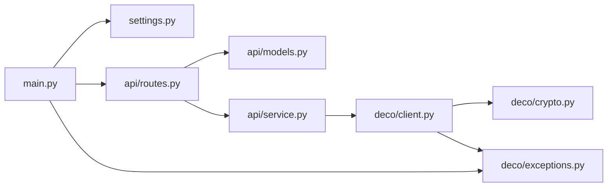

# Deco BE85 API

TP-Link Deco BE85 のローカル Web API (Deco アプリが内部で叩いている API) を
FastAPI + Pydantic でラップした REST サーバーです。ステータス取得や Wi-Fi の
ON/OFF などをローカルネットワークから操作できます。

## セットアップ

```bash
make setup   # uv sync + (.env が無ければ) .env.example をコピー
```

`.env` に認証情報を記載します。

```dotenv
PASSWORD=<Deco 管理パスワード (TP-Link ID のパスワード)>
# 任意 (既定値)
DECO_HOST=http://172.16.1.1
ACCOUNT=admin        # 署名 hash に使うローカルアカウント名 (通常 admin のまま)
VERIFY_SSL=false
TIMEOUT=30
```

## 起動

```bash
make run   # uv run uvicorn main:app --reload --app-dir src --host 127.0.0.1 --port 8000
```

- Swagger UI: http://127.0.0.1:8000/docs
- ルーターへのログインは遅延 (最初の API 呼び出し時)。401/403 やログイン画面 (非 JSON) が
  返ったら自動で再ログインして 1 回だけ再送します。
- `DecoClient` はセッション状態を持つため、リクエストはサーバー側の lock で直列化されます。

### Docker

```bash
make build-image   # docker build -t deco-be85-api:latest .
make run-image     # docker run --rm -p 8000:8000 --env-file .env deco-be85-api:latest
```

多段ビルド (`uv` ビルダ → `python:slim` ランナー、非 root 実行)。認証情報は
`--env-file .env` などで実行時に注入します (イメージには含めません)。

## エンドポイント

| Method | Path                         | 説明                                        |
| ------ | ---------------------------- | ------------------------------------------- |
| GET    | `/api/health`                | サーバー状態とログイン状況                  |
| POST   | `/api/login`                 | 明示ログイン                                |
| POST   | `/api/logout`                | ログアウト                                  |
| GET    | `/api/dashboard`             | 概況 (回線 / CPU / メモリ / Deco 台数 / 接続数) |
| GET    | `/api/devices`               | Deco ユニット (メッシュノード) 一覧         |
| GET    | `/api/clients`               | 接続クライアント一覧 (`?online_only=true`)  |
| GET    | `/api/clients/blocked`       | ブロック中クライアント一覧                  |
| GET    | `/api/network/wan`           | WAN IPv4 ステータス                         |
| GET    | `/api/network/internet`      | インターネット接続情報 (IPv4 / IPv6)        |
| GET    | `/api/network/lan`           | LAN / DHCP DNS / WAN IP                     |
| GET    | `/api/network/ipv6`          | IPv6 有効状態                               |
| GET    | `/api/network/performance`   | CPU / メモリ使用率                          |
| GET    | `/api/network/mac-clone`     | MAC クローン設定                            |
| GET    | `/api/network/wan-mode`      | WAN ポートの動作モード                      |
| GET    | `/api/network/dhcp-dial`     | WAN の DHCP 接続設定 (unicast)              |
| GET    | `/api/network/igmp`          | IGMP (マルチキャスト) 設定                  |
| GET    | `/api/network/fast-xmit`     | fast xmit の有効状態                        |
| GET    | `/api/network/vlan`          | VLAN (IPTV) 設定                            |
| GET    | `/api/wireless`              | Wi-Fi 設定の取得                            |
| POST   | `/api/wireless`              | バンド別 Wi-Fi の ON/OFF                    |
| POST   | `/api/wireless/config`       | Wi-Fi 設定変更 (SSID / パスワード / enable 等) |
| GET    | `/api/wireless/power`        | 電波 (DFS サポート等)                       |
| GET    | `/api/wireless/beamforming`  | beamforming の有効状態                      |
| GET    | `/api/device/mode`           | 動作モード (region / workmode / sysmode)    |
| GET    | `/api/device/time`           | 時刻・タイムゾーン設定                      |
| GET    | `/api/cloud/device-info`     | クラウド連携情報 (model / role 等)          |
| GET    | `/api/system/component-info` | ERP / 省電力等のコンポーネント情報          |
| GET    | `/api/system/switch-list`    | UI 機能スイッチ                             |
| GET    | `/api/system/log-types`      | ログ種別 (`/api/system/log` の `level`)     |
| GET    | `/api/system/log`            | システムログ (`?level=&index=&limit=`)      |
| GET    | `/api/system/firmware`       | ファームウェア更新の有無 (cloud に問い合わせ) |
| POST   | `/api/reboot`                | Deco の再起動 (`confirm=true` 必須)         |
| POST   | `/api/raw`                   | 任意エンドポイントへの汎用パススルー        |

モデル (`DecoNode` 等) を定義している endpoint 以外は、ルーターの応答をそのまま返します
(フィールドはファームウェアで異なりうる)。モデル化した endpoint も主要フィールドだけを定義し、
未知のフィールドは保持して返します (`extra="allow"`)。

### エラー

| Status    | 意味                                                                 |
| --------- | -------------------------------------------------------------------- |
| 400 / 422 | リクエスト検証エラー (`confirm` 無し、未知の `settings` フィールド等) |
| 401       | ルーターへのログイン失敗 (`DecoAuthError`)                           |
| 502       | ルーターがエラーを返した (`detail` と `error_code`)                  |
| 504       | ルーターに到達できない (`DecoConnectionError`)                       |

### Wi-Fi トグル例

```bash
curl -X POST http://127.0.0.1:8000/api/wireless \
  -H 'Content-Type: application/json' \
  -d '{"band":"band5_1","network":"host","enable":false}'
```

`band` は `band2_4` / `band5_1` / `band6`、`network` は `host` / `guest` (enum で検証)。

### Wi-Fi 詳細設定の変更 `/api/wireless/config`

`admin/wireless?form=wlan` への `operation:write`。`band` × `network` (host / guest) ごとに
`enable` / `ssid` / `password` / `enable_hide_ssid` / `channel` / `channel_width` / `mode`
を指定できます (指定したフィールドのみ送信)。`ssid` / `password` は**平文で渡すと内部で
base64 エンコード**します (ルーターは base64 で保持するため)。

```bash
# ゲスト Wi-Fi の SSID とパスワードを変更
curl -X POST http://127.0.0.1:8000/api/wireless/config \
  -H 'Content-Type: application/json' \
  -d '{"band":"band5_1","network":"guest","settings":{"enable":true,"ssid":"My Guest","password":"secretpass"}}'
```

> Wi-Fi 設定の変更は接続中クライアントに一時的な影響があります。`settings` は未知フィールドを
> 拒否 (`extra="forbid"`) し、最低 1 項目の指定が必須です。設定値は `GET /api/wireless` の構造
> (`band.host` / `band.guest`) に対応します。

### システムログ `/api/system/log`

`admin/log_export?form=feedback_log` を `operation:build` → `operation:read` の順に呼びます
(Web UI と同じ手順。build でルーター側に level で絞ったスナップショットを作らせる)。

```bash
curl 'http://127.0.0.1:8000/api/system/log?level=3&index=0&limit=100'
```

- `level`: `/api/system/log-types` の `value` (1 ALERT 〜 7 DEBUG、8 ALL。既定 8)。その重要度までを含む
- `index`: 0 始まりのページ番号 (既定 0)
- `limit`: 1 ページの件数 (既定 100)
- 応答: `{"totalNum": <limit での総ページ数>, "currentIndex": <index>, "logList": [{"content": "..."}]}`

### ファームウェア更新チェック `/api/system/firmware`

`admin/cloud?form=firmware_status` の `operation:check` で TP-Link cloud に問い合わせ、ノードごとの
`software_ver` / `new_version` / `need_to_upgrade` などを返します (数秒かかる)。更新の適用
(`operation:download` / `upgrade`) は提供しません。

### 汎用パススルー `/api/raw`

任意の Deco エンドポイントを直接叩けます。レスポンスは復号済みのエンベロープ全体
(`result` / `error_code` または `success` / `data`) をそのまま返します。

```bash
curl -X POST http://127.0.0.1:8000/api/raw \
  -H 'Content-Type: application/json' \
  -d '{"path":"admin/client?form=client_list","operation":"read","params":{"device_mac":"default"}}'
```

- `path`: `admin/<module>?form=<form>` 形式の相対パス (英数字と `_`、`/`、1 つの `?form=` のみ)
- `operation`: `read` / `write` / `load` / `list` / `get` / `set` / `add` / `edit` / `remove` / `operate` / `check` / `build` (enum)
- `params`: 任意の追加パラメータ (省略可)

> `operation: write` と適切な `params` を渡すと設定を変更できる強力な口です。

### 再起動例 (破壊的操作)

```bash
curl -X POST http://127.0.0.1:8000/api/reboot \
  -H 'Content-Type: application/json' -d '{"confirm":true}'
```

## 開発

```bash
make lint     # ruff format --check + ruff check + ty check
make format   # ruff format
make test     # coverage run -m pytest + coverage report
uv run pre-commit install   # commit 時に同じチェックを走らせる
```

ruff / ty の設定は `pyproject.toml`。バージョンは `uv.lock` で一元管理し、pre-commit は
`uv run` 経由の local hook で同じバージョンを使います。

## CI (GitHub Actions)

`.github/workflows/ci.yaml` (PR・main push・手動で起動) に 2 ジョブ:

- `Pre-commit` … `uv run pre-commit run --all-files` (ファイル衛生 + ruff + ty)
- `Test` … `uv run pytest`

Action は SHA ピン留め。依存更新は `.github/dependabot.yml` (github-actions / uv を weekly)。

## 仕組み

Deco の管理画面と同じログインフローを再現しています。

1. `POST /cgi-bin/luci/;stok=/login?form=keys` … パスワード暗号化用 RSA 公開鍵を取得
2. `POST /cgi-bin/luci/;stok=/login?form=auth` … 署名用 RSA 公開鍵 (512 bit) + `seq` を取得
3. セッションごとにランダムな AES-128-CBC 鍵 / IV を生成
4. リクエスト本文を AES 暗号化し、署名を RSA 暗号化 (53 byte チャンク)
   - ログイン時の署名: `k=<key>&i=<iv>&h=<hash>&s=<seq+len>` (AES 鍵 / IV を同梱)
   - ログイン後の署名: `h=<hash>&s=<seq+len>`
   - `hash = md5("admin" + password)` … 認証後エンドポイントはこの hash を検証する
5. `form=login` で `stok` と `sysauth` Cookie を取得し、以降のリクエストで利用

> 実機 (BE85 / FW 1.2.2) の Web UI を解析して確認した挙動です。署名 hash には
> ローカル管理アカウント名 `admin` を使い、TP-Link ID (メール) はローカル API では使いません。

```mermaid
sequenceDiagram
    participant C as DecoClient
    participant R as Deco (luci)
    C->>R: POST login?form=keys
    R-->>C: パスワード暗号化用 RSA 公開鍵
    C->>R: POST login?form=auth
    R-->>C: 署名用 RSA 公開鍵 + seq
    Note over C: AES 鍵 / IV を生成 (SessionCipher)
    C->>R: POST login?form=login<br/>data = AES(RSA(password)), sign = RSA(k, i, h, s)
    R-->>C: AES(stok) + Set-Cookie: sysauth
    C->>R: POST ;stok=…/admin/…?form=… (Cookie: sysauth)<br/>data = AES(body), sign = RSA(h, s)
    R-->>C: {"data": AES(envelope)}
```

暗号化は `src/deco/crypto.py` (`SessionCipher`)、ログイン / 通信は
`src/deco/client.py` (`DecoClient`) にあります。

### 実機で確認した luci form (BE85 / FW 1.2.4)

luci に登録されている admin モジュールは `administration` / `client` / `cloud` / `cloud_account` /
`component_control` / `device` / `log_export` / `network` / `system` / `web` / `wireless` の 11 個で、
`firmware` / `qos` / `parental_control` / `dhcps` / `led` などは HTTP 404 (Web UI が参照する
`admin/firmware?form=config` や `admin/isp?form=isp_upgrade` も含む)。存在しない form は
HTTP 200 で `{"error_code": 1, "msg": "no such callback"}` または
`{"success": false, "errorcode": "..."}` (モジュールにより形が異なる) を返すので、form の有無はこれで判別できる。

読み取れることを確認したが API にしていない form:

| form | 理由 |
| --- | --- |
| `admin/cloud_account?form=get_token` | cloud のトークンを返すため公開しない |
| `admin/administration?form=account` | 管理アカウント変更用の form。read も公開しない |
| `admin/cloud_account?form=check_internet` | `{"success": true}` のみ。`/api/network/internet` で足りる |
| `admin/client?form=traffic_stat` (`operation:list`) | `client_list_speed` の up / down speed で `/api/clients` と重複 |
| `admin/network?form=erp_setting`・`wifi_network` | この機種では `{}` を返す |
| `admin/log_export?form=save_log`・`admin/system?form=envar` | multipart 前提で JSON envelope では HTTP 500 |

## 構成

`src/` 直下をトップレベルパッケージとして解決する virtual プロジェクト (ビルドなし)。
実行・テストは `--app-dir src` / `pythonpath = ["src"]` / `PYTHONPATH=src` で解決します。

```
src/
  deco/            Deco ローカル API クライアント (FastAPI 非依存・単体利用可)
    crypto.py        AES / RSA 暗号化と署名 (SessionCipher)
    client.py        ログイン・再ログイン・エンドポイント呼び出し (DecoClient)
    exceptions.py    DecoError / DecoAuthError / DecoConnectionError
  api/             FastAPI 層
    routes.py        エンドポイント定義
    models.py        request / response モデル
    service.py       DecoClient を lock + worker thread で直列実行する DecoService
  settings.py      環境変数 (pydantic-settings)
  main.py          FastAPI アプリと、例外 → HTTP status の対応
tests/             オフライン単体テスト (src の構成をミラー)
```

`deco/` はプロトコル層 (暗号化・ログイン・通信・base64 名の復号)、`api/` は Web 層という
責務分離です。



## 注意

- ローカルネットワーク内 (同一サブネット) からの利用を想定しています。
- Deco のファームウェアによってレスポンスのフィールドが異なる場合があります。
  `/docs` の生 JSON も確認してください。

## 免責 / Disclaimer

本プロジェクトは **TP-Link 非公式**であり、TP-Link 社とは一切関係ありません。
Deco の公開されていないローカル API をリバースエンジニアリングして利用しています。

- **自分が管理権限を持つ機器に対してのみ**使用してください。
- ファームウェア更新で API が予告なく変わる可能性があります。
- 本ソフトウェアは現状有姿 (AS IS) で提供され、いかなる保証もありません。
  利用によって生じた損害について作者は責任を負いません。

## 謝辞 / Acknowledgements

ログインの暗号化フロー (RSA + AES-CBC + 署名) は、以下の公開リバースエンジニアリング
成果を参考に再実装しています。

- [AlexandrErohin/TP-Link-Archer-C6U](https://github.com/AlexandrErohin/TP-Link-Archer-C6U)
  (GPL-3.0) — TP-Link / Deco の暗号化ログイン手順
- BE85 本体の Web UI (`tpEncrypt.js` 等) を解析し、`md5("admin"+password)` 署名や
  `device_mac` パラメータ等の機種固有の挙動を確認

## ライセンス / License

[GPL-3.0-or-later](LICENSE)。上記の参考実装が GPL-3.0 であることに合わせています。
